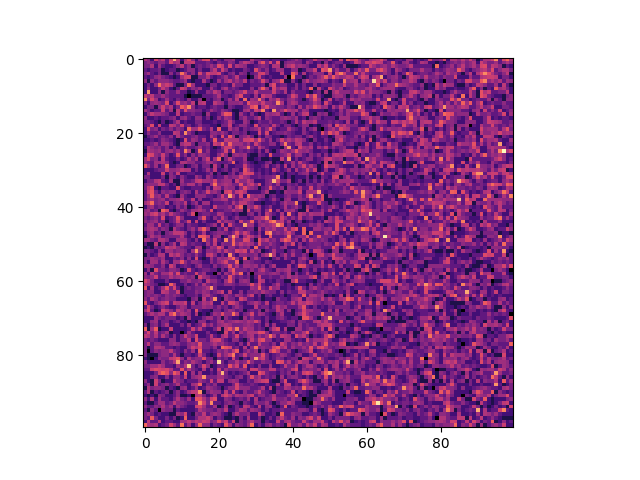

# Task 02

## Ex1

if a and B are of same dim, we get array C with component-wise addition 

## Ex2 

with subarrays we can set whole subarray to a scalar, which is what we do in assignment A=7; , each element of A is now equal to (int) 7 

B is subarray of A, thus parts of A in range of B will be changed to 4 by the last assignment 

## Ex3 

```
GeneralArrayStorage<3> storage;
storage.base() = 10, 0, 0; 
Array<int, 3> A(5, 20, 20, storage);
```
## Ex4 

modified two templates, ploted the data with python : 




which looks just like Prof. Potter's https://www.astro.uzh.ch/~dpotter/ESC412/auto100.png 