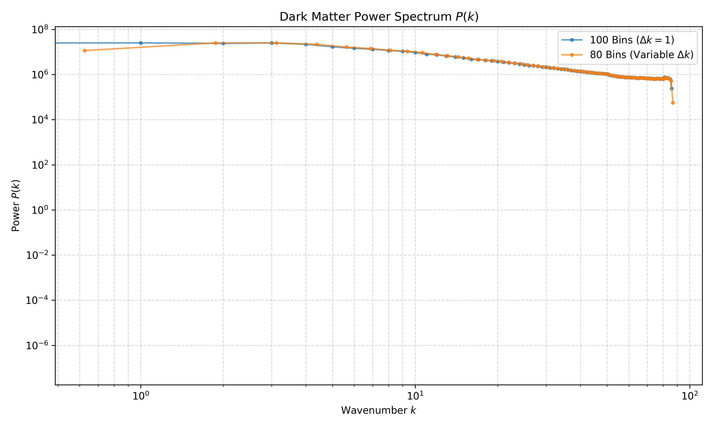
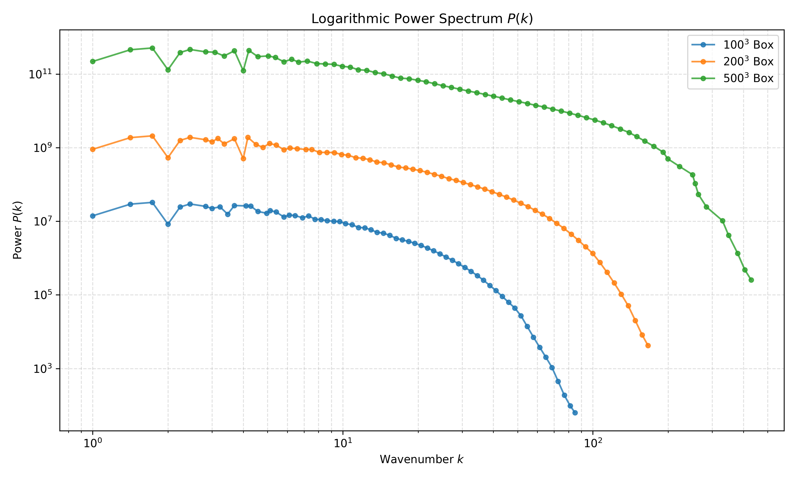

## Task 5


from the last task i forgot to do testing so here it is : 

[PASS] kernel samples
[PASS] partition of unity + non-negativity
[PASS] single-particle stencil vs reference
[PASS] periodic wrapping vs reference
[PASS] mass conservation
All 5 tests passed.


### Ex1 

So because our fft library transforms nGrid into [positive freq : negative freq] array, we translate out indexes as (i <= nGrid / 2) ? i : i - nGrid , that also implies we can interate only through half of z dimmension so we declare int k_z_max = nGrid / 2; which saves us memory. 

### Ex2 

Modified the loop with float power = std::norm(delta_k); and saved the bins.saving into .txt file 

### Ex3

Modified the binning loop with introducing new variable delta_bin int bin_idx = static_cast<int>(mag_k / delta_bin);

then ploted comparison of ex2 and bins80 



### Ex4 

so, we should avoid laculation i_bin for super narrow bins to avoid division by 0 
so we gotta add 
```
if (mag_k > 0.0f) {
                    std::complex<float> delta_k = kdata(i, j, k);
                    float power = std::norm(delta_k);
                    ...

```
also skipping empty bins completely  now 
```
for (int b = 0; b < n_bins; ++b) {
        if (nPower[b] > 0) {
            float average_power = fPower[b] / static_cast<float>(nPower[b]);
            
            float average_k = k_sum[b] / static_cast<float>(nPower[b]);
            
            pkFile << average_k << " " << std::scientific << average_power << "\n";
        }
    }
```

